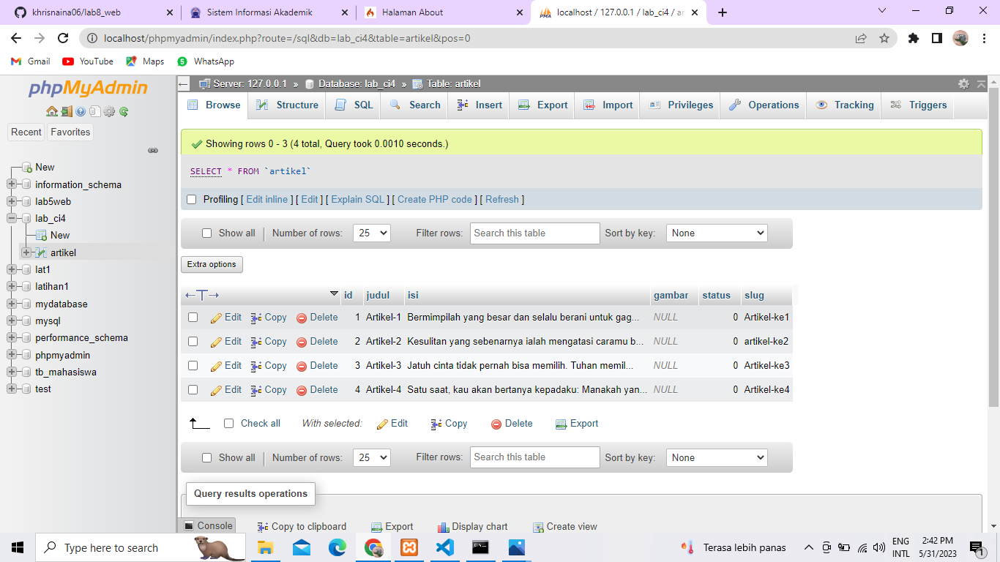
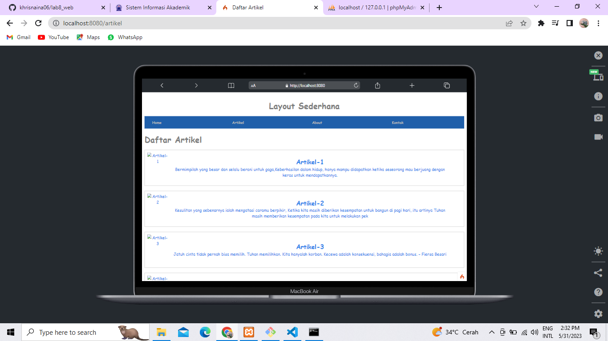
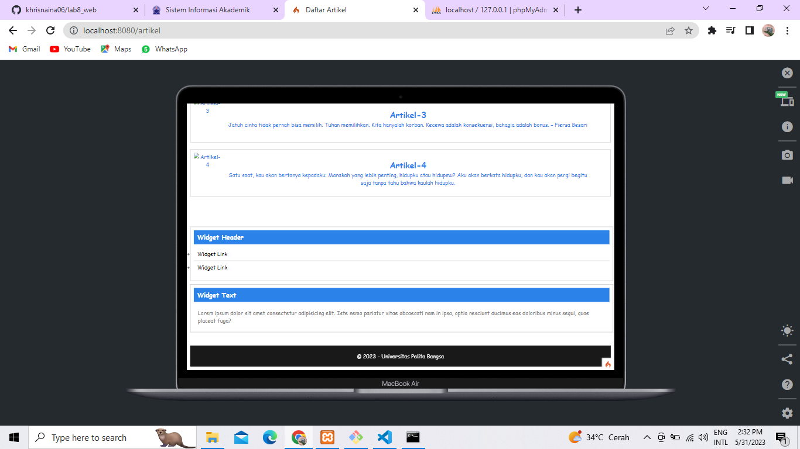
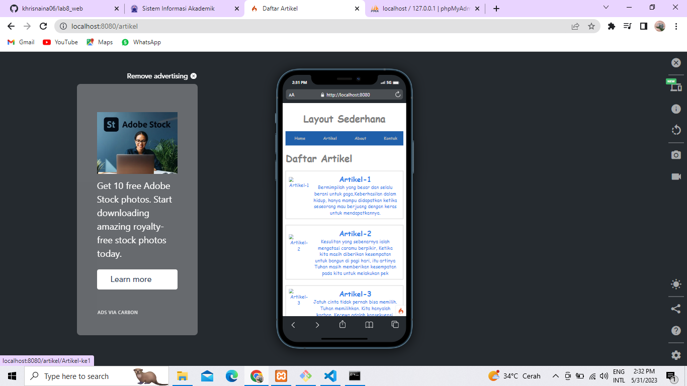
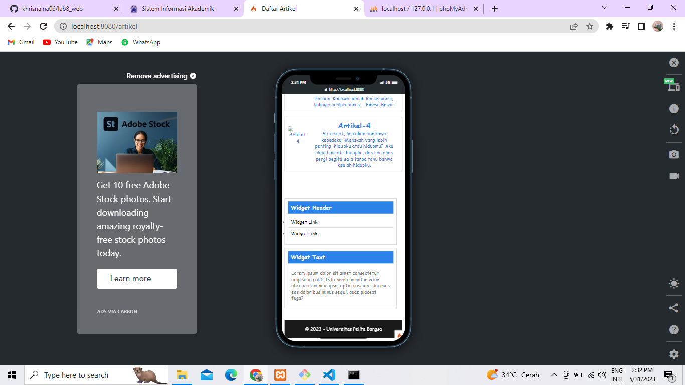
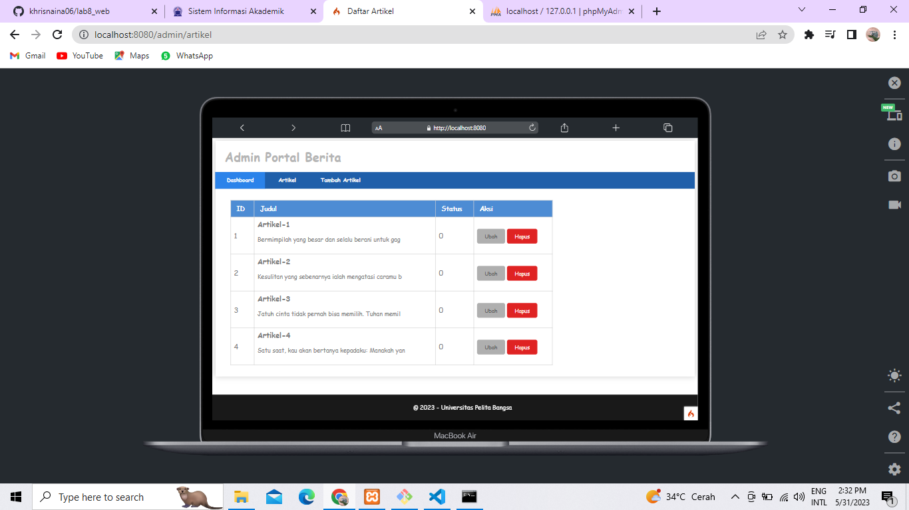
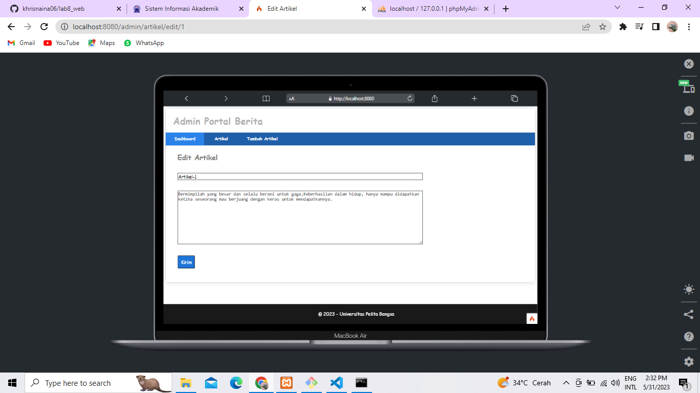
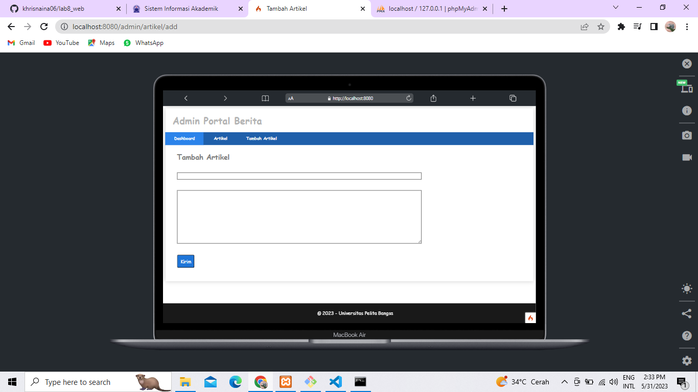
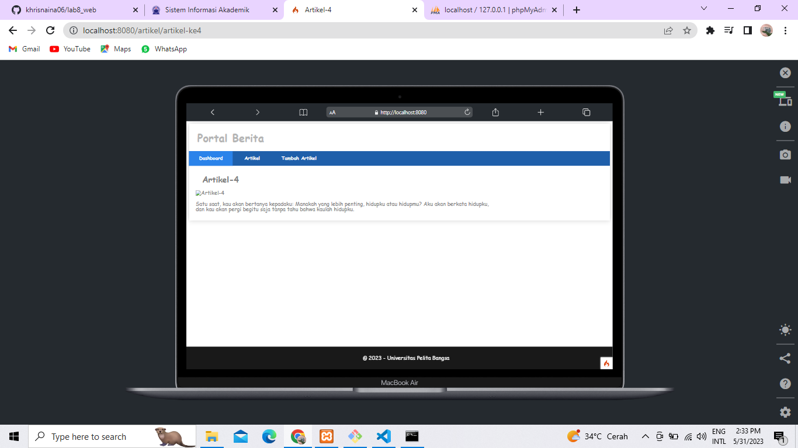

# lab8_web
# Framework lanjutan(CRUD)
---
Berikut ini adalah output dari Pembuatan Aplikasi CRUD Sederhana Dengan MySQL .

## Output
---
- **Database my sql**

- **Laman Artikel**

- **Laman Artikel Yang Responsive ketika di buka di handphone**

- **Laman admin**

- **Laman Ubah Artikel Ketika Di Klik button ubah di laman admin**

- **Laman tambah artikel**

- **Laman Artikel Detail**

# TERIMA KASIH 
